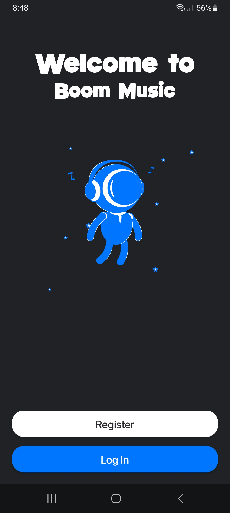
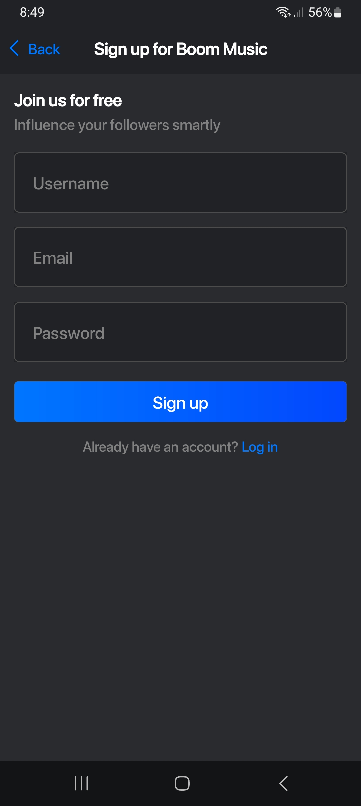
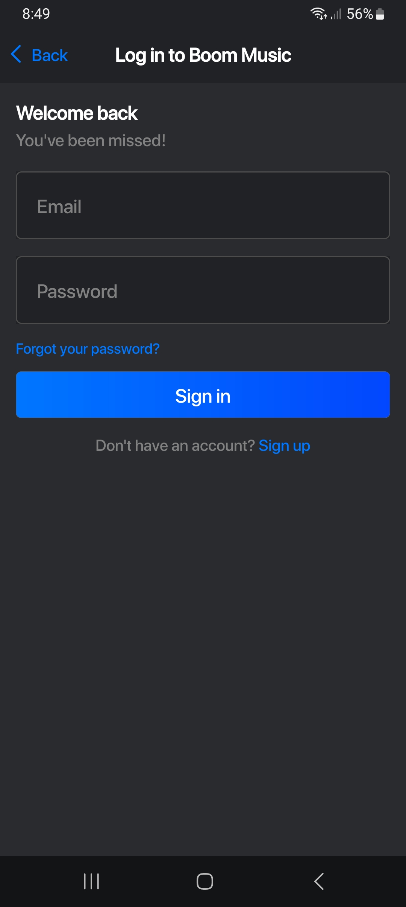
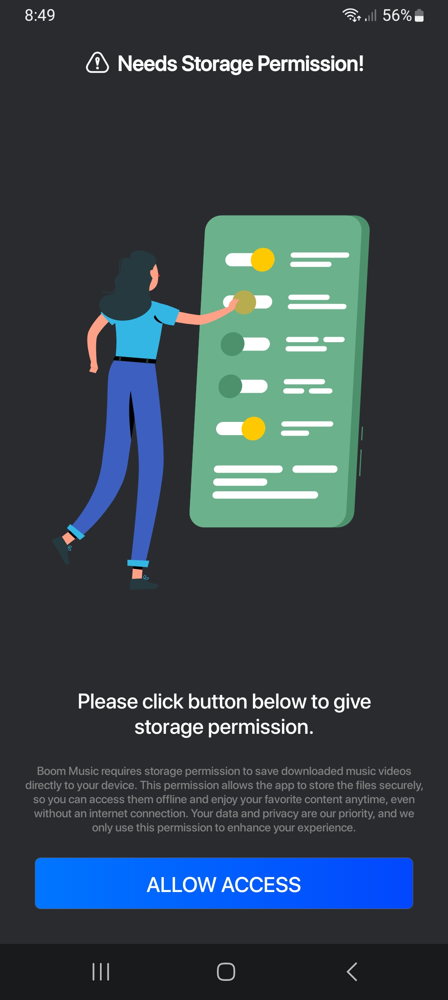
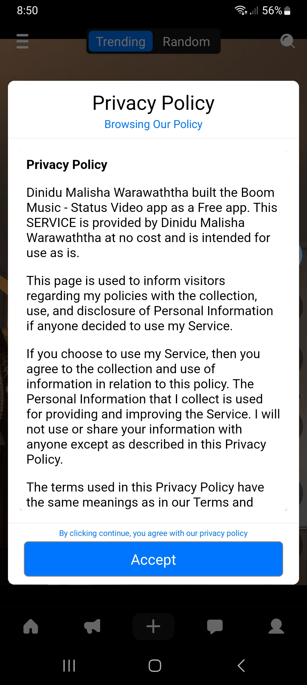
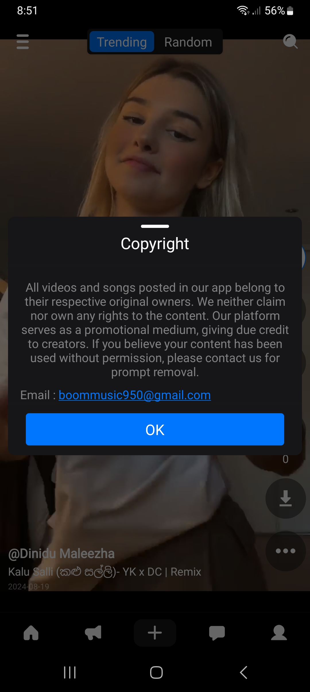
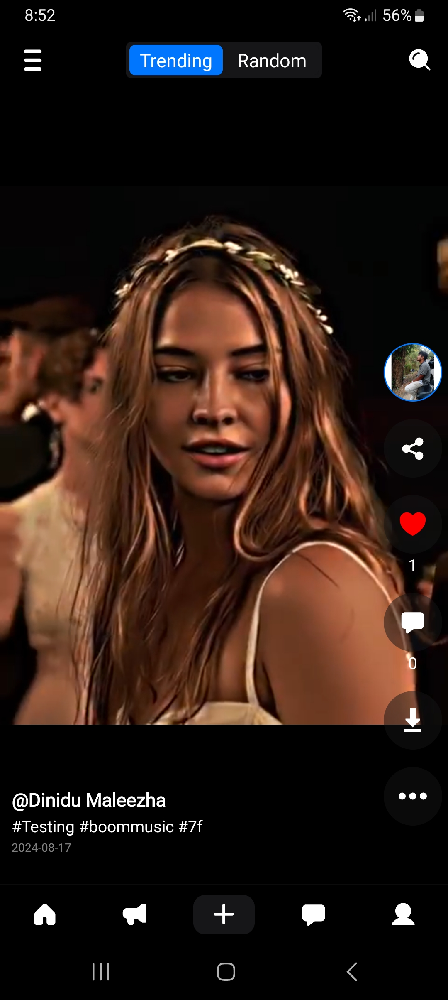

# 🎵 Boom Music - Status Video

**Boom Music** is the ultimate music and video platform for Sri Lankan music enthusiasts. Whether you're seeking the latest chart-topping hits or nostalgic classics, Boom Music curates an expansive collection of songs and videos that celebrate Sri Lanka's rich musical heritage.

## 🌟 Screenshots

Here are some screenshots of the app in action:

| Home Screen | Music Player | Playlist Creation |
|-------------|--------------|-------------------|
|  |  |  |

| Video Player | Explore | Search |
|--------------|---------|--------|
|  |  |  |

| Settings | Dark Mode | Equalizer |
|----------|-----------|-----------|
|  |  |  |

| Sharing Feature |
|----------------|
|  |

## 🎉 About Boom Music

**Boom Music - Status Video** offers an innovative platform designed to bring the best of Sri Lanka’s music scene to your fingertips. With a diverse collection of new and timeless songs, this app is a musical haven that caters to all tastes and preferences.

Discover the rhythm and melodies that define Sri Lanka's rich cultural landscape, from modern hits to cherished oldies. Boom Music is not just about streaming; it's about connecting with the heartbeat of Sri Lankan music and celebrating the diversity of its sounds.

## 🌟 Key Features

- 🎶 **Extensive Music & Video Collection**: Access a wide range of genres, from pop hits to traditional melodies.
- 🎥 **Status Video**: Explore a vast collection of music videos, perfect for your status updates.
- 🧭 **User-Friendly Navigation**: Seamlessly explore our curated playlists and vast library.
- 🌍 **Cultural Connection**: Dive into Sri Lanka’s musical landscape and connect with both new and traditional sounds.
- 🎧 **Personalized Recommendations**: Receive suggestions based on your listening preferences.
- 🔥 **Latest Hits & Classics**: Stay up-to-date with the newest releases while embracing timeless classics.

## 📦 App Information

- **Android Version**: Requires Android 5.0 and up
- **Release Date**: January 19, 2023
- **Offered By**: Boom Studio LK
- **Developed By**: Dinidu Maleesha

## 🚀 Getting Started

1. Download and install **Boom Music - Status Video** from the [Google Play Store](https://play.google.com/store/apps/details?id=com.boomstudio.boommusic).
2. Launch the app and start exploring Sri Lanka’s best music and videos.

## 🤝 Contact Us

We respect the rights of all creators. If you believe your content has been used without permission, please contact us for immediate action.

- 📧 Email: boommusic950@gmail.com

## 📦 App Links

- [Google Play Store](https://play.google.com/store/apps/details?id=com.boomstudio.boommusic)

---

© All videos and songs posted in our app belong to their respective original owners. We neither claim nor own any rights to the content. Our platform serves as a promotional medium, giving due credit to creators.
